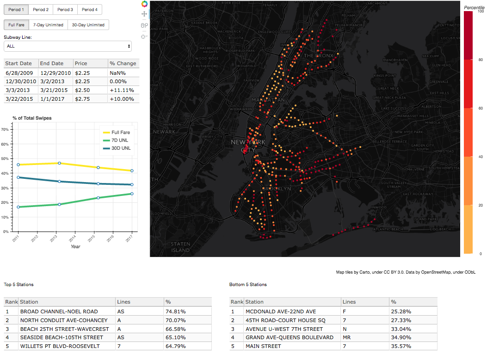

# MTA Interactive Map of MetroCard Usage by Type

#### Important: In order to render the widgets used for interacting with the map, you will need to download the notebook and run it with a Jupyter notebook server. Alternatively, you can run the more complete map by running a Bokeh server (instructions below).

This map shows the usage rates of different types of MetroCards (i.e. Full Fare, 7-Day Unlimited, 30-Day Unlimited) at every station, which are represented by the dots. For every station, if you hover over the dot, you can see information about the percentage of swipes at the station for each MetroCard type. The color of the dot represents the percentile rank of each station in terms of usage (see the legend on the right of the map). The darker the color, the more a station registers swipes for that type of MetroCard (as a percentage).

Due to the limitaions of Bokeh within a Jupyter Notebook, some tables and graphs were unable to be shown here. For the full experience, please follow the instructions below on how to run the interactive map as a Bokeh server:

To run the script, please install bokeh using either of the following commands:
 <i>conda install -c bokeh/channel/dev bokeh</i>
 or
 <i>pip install --pre -i https://pypi.anaconda.org/bokeh/channel/dev/simple bokeh --extra-index-url https://pypi.python.org/simple/</i>

Then, you can use the following command to open the interactive map (it will open in a browser tab):
 <i>bokeh serve --show interactive_map.py</i>

Screenshot:

### Data Analysis Notebooks:
Credit to Allen Downey's code, which was used for plotting/visualizations and statistical analysis. It is from his book, "Think Stats", which can be found here:
 greenteapress.com/thinkstats2/thinkstats2.pdf 
 Credit to chriswhong for manually entering lat/long info for each station by remote code. His Github is here:
 https://github.com/chriswhong/nycturnstiles 
